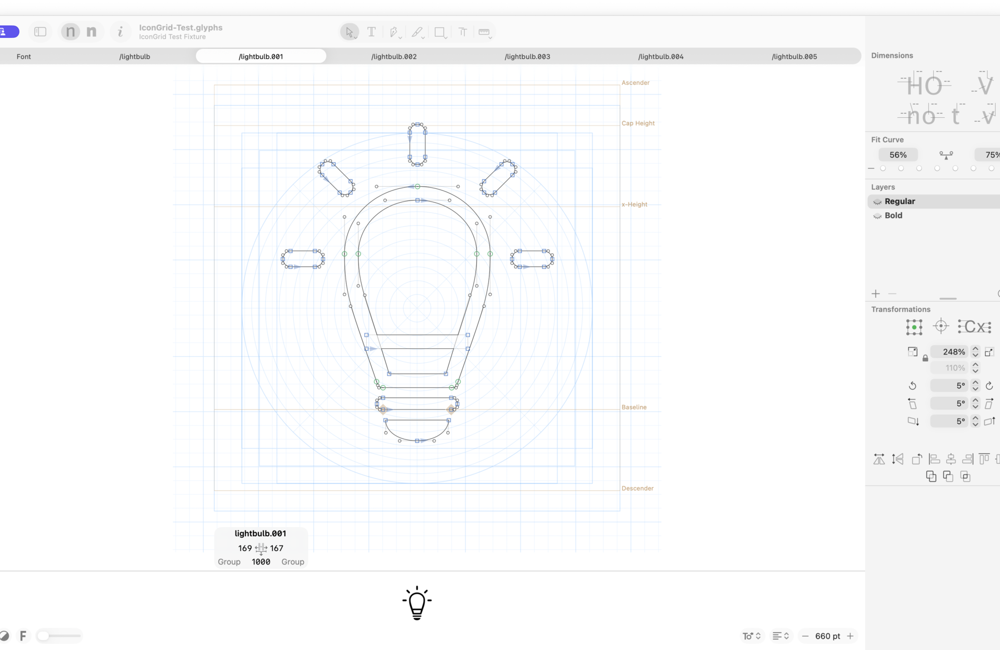

# GlyphsIconGrid

[](https://github.com/thierryc/GlyphsIconGrid/actions/workflows/test.yml)
[](https://thierryc.github.io/GlyphsIconGrid/)
[](https://glyphsapp.com/)
[](LICENSE)

GlyphsIconGrid is a no-dialog reporter plug-in that draws an icon construction system behind the active glyph in Glyphs 3 and Glyphs 4. It adds a font-aligned square grid, circular guides, radial spokes, and common icon keylines without changing outlines, snapping, exports, or saving the document.

Visit the [GlyphsIconGrid website](https://thierryc.github.io/GlyphsIconGrid/) for the visual setup guide.



## Features

- A 24 × 24 one-em square construction canvas by default.
- Horizontal centering on the glyph advance and vertical centering between the baseline and x-height.
- A compact background grid that overflows the icon square in every direction for exceptional artwork.
- A cell-centered `odd` grid by default, with an optional line-centered `even` mode.
- Padded live area, true circular rings, radial spokes, and Material-derived circle, square, portrait, and landscape keylines.
- One exact grid size in font units that controls both square cells and circular spacing for each master.
- Blue guides that remain visually distinct from Glyphs metric and user guides.
- Strict alignment feedback near a guide while drawing, shaping, or moving nodes; it never acts as snapping.
- Font-level custom parameters with optional per-master overrides.

## Install

1. Download a ZIP from [Releases](https://github.com/thierryc/GlyphsIconGrid/releases) and extract it.
2. Double-click `IconGrid.glyphsReporter`, or move it into the plug-in folder for the Glyphs version you use.
3. Restart Glyphs.
4. Open a glyph in Edit view and choose **View → Show Icon Grid**.

The source bundle is validated for Glyphs 3.5 and Glyphs 4. See the [release test checklist](docs/RELEASE_TESTS.md) for the exact automated and live checks.

## Configure

No font-level parameters are required. For a 1000-UPM icon family, add just one custom parameter to each master in **File → Font Info → Masters → Custom Parameters**:

```text
Regular master: IconGrid.gridSize = 34
Bold master:    IconGrid.gridSize = 72
```

`gridSize` controls both the square grid size and the distance between concentric circles. The default `odd` mode centers one grid cell on the construction axes; set `IconGrid.gridMode = even` only when the axes should coincide with grid lines. Other parameters are optional advanced customization.

See the [human user guide](docs/USER_GUIDE.md) for recipes and troubleshooting, and the [complete parameter reference](docs/PARAMETERS.md) for all 17 supported parameters.

## Glyphs MCP automation

The repository includes the distributable [`glyphs-mcp-icon-grid` skill](skills/glyphs-mcp-icon-grid/SKILL.md). It inspects font and master scopes, validates every `IconGrid.*` value, previews writes, removes redundant settings safely, reads the result back, and never saves the font implicitly.

Connect the Glyphs MCP **Edit** profile and verify the target font before changing it. The [Glyphs MCP guide](docs/GLYPHS_MCP.md) covers installation, safe calls, inheritance, and example prompts.

Install the skill for a supported local AI client without changing that client's MCP settings:

```sh
python3 scripts/install_skill.py --client codex --scope user --dry-run
python3 scripts/install_skill.py --client codex --scope user
```

Replace `codex` with `claude`, `gemini`, or `cursor`. The first command previews the destination; the second copies the complete skill directory.

## Documentation

- [User guide](docs/USER_GUIDE.md)
- [Custom parameter reference](docs/PARAMETERS.md)
- [Glyphs MCP automation](docs/GLYPHS_MCP.md)
- [Behavioral specification](docs/SPECIFICATION.md)
- [Release test checklist](docs/RELEASE_TESTS.md)
- [Release process](docs/RELEASING.md)
- [Changelog](CHANGELOG.md)
- [Contributing](CONTRIBUTING.md)
- [Tracked test fixture](tests/fixtures/README.md)

## Develop and test

The configuration, geometry, and interaction core imports neither Glyphs nor AppKit, so the deterministic suite runs with standard Python:

```sh
python3 -m unittest discover -v
python3 -m compileall -q IconGrid.glyphsReporter tests scripts
python3 scripts/validate.py IconGrid.glyphsReporter --target both
python3 scripts/package.py
```

CI runs the unit, compile, static bundle, dual-target, and packaging checks. Live UI behavior is covered separately by the release checklist. The tracked fixture at `tests/fixtures/IconGrid-Test.glyphs` contains the `/lightbulb` artwork and two masters used by the documentation and manual tests.

## License and attribution

GlyphsIconGrid is licensed under [Apache-2.0](LICENSE). The official GlyphsSDK reporter template and universal wrapper are attributed in [NOTICE](NOTICE). MasterGrid is acknowledged as prior inspiration; GlyphsIconGrid’s parameter contract, configuration resolution, geometry, rendering, and tests were independently written.
