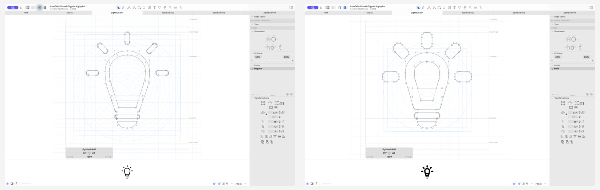

# GlyphsIconGrid 0.1.0 test report

> The earlier sections preserve evidence for the superseded explicit 34/72 grid
> candidate. A fresh H-stem inheritance and baseline-to-cap-height centering pass
> was completed on 2026-07-27 and is recorded below.

Status: **release candidate validated; public tag blocked by the remaining live
interaction rows in `docs/RELEASE_TESTS.md`.**

## Environment

| Item | Value |
| --- | --- |
| Test date | 2026-07-23, America/New_York |
| macOS | 26.6 (25G5065a) |
| Live-tested implementation commit | `80c2bff0c75b26467e95b78ab8c1c6e5453b290c` |
| Glyphs 3 | 3.5 build 3530 |
| Glyphs 3 Python | 3.12.3 |
| Glyphs 4 | 4.0 build 3879 |
| Glyphs 4 Python | 3.14.6 |
| Glyphs MCP Server | 1.3.0+530686cb28e8 |
| Plug-in version/build | 0.1.0 / 1 |

The tag-triggered workflow must rerun the automated gate on the exact tagged
commit.

## 2026-07-27 H-stem and vertical-center verification

Both installed reporter locations are symbolic links to the working
`IconGrid.glyphsReporter` bundle. Each Glyphs app was quit and relaunched before
testing so it loaded the updated source. The tracked fixture was closed before
two uniquely named disposable copies were created under `/private/tmp`.

| Check | Glyphs 3.5 build 3530 | Glyphs 4.0 build 3879 |
| --- | --- | --- |
| Python runtime | 3.12.3 | 3.14.6 |
| Reporter menu | **View → Show Icon Grid** present | **View → Show Icon Grid** present |
| Regular master | H stem `84`; redraw uses 84-unit spacing | H stem `84`; redraw uses 84-unit spacing |
| Bold master | H stem `135`; redraw uses 135-unit spacing | H stem `135`; redraw uses 135-unit spacing |
| Stored `IconGrid.*` values | None at font, master, or effective scope | None at font, master, or effective scope |
| Metrics | baseline `0`, cap height `700` | baseline `0`, cap height `700` |
| Construction center, 1027-unit layer | `(513.5, 350)` | `(513.5, 350)` |
| Automatic live/keyline diameter | `875`; landscape keyline at `y = 0…700` | `875`; landscape keyline at `y = 0…700` |
| Background field | Four H-stem cells beyond each canvas edge | Four H-stem cells beyond each canvas edge |
| Visible circles, Regular | Three: two inner rings plus outer keyline | Three: two inner rings plus outer keyline |
| Visible circles, Bold | Three: two inner rings plus outer keyline | Three: two inner rings plus outer keyline |

The stem records were read through Glyphs MCP 1.3.0
(`1.3.0+530686cb28e8`). Switching between Regular and Bold produced a clean,
immediate redraw in both apps. The expanded background field and reduced circle
set were visually confirmed in both versions. No source fixture or user font
was saved; both disposable test copies were closed with changes discarded. The
current automated suite also passed all 132 tests.

## Automated validation

- `python3 -m unittest -q`: **132 passed**
- Python bytecode compilation: **passed**
- `scripts/validate.py IconGrid.glyphsReporter --target both`: **passed**
- `scripts/release_check.py --tag v0.1.0 --require-artifacts`: **passed**
- `scripts/build_site.py`: **passed**
- `scripts/package.py`: **passed**
- `GlyphsIconGrid-0.1.0.zip` SHA-256:
  `813fac0cb5799115757203188b32f2202cfd0c8dbf69c4a9b80ae303a95ec026`
- Skill-installer dry-runs for Codex, Claude, Gemini, and Cursor: **passed**
- Local Pages review in Safari at 1440 × 900 and 390 × 844: **passed**
- AI setup tabs by pointer and Arrow Right: **passed**
- Dark-mode and reduced-motion CSS rules present at runtime: **passed**
- Browser console warnings/errors: **none**

## Fixture matrix through Glyphs MCP

Every source fixture was copied while closed into a unique directory under
`/private/tmp`. All non-designated copies were closed with changes discarded.

| Case | Glyphs 3 | Glyphs 4 | Result |
| --- | --- | --- | --- |
| Built-in defaults | Pass | Pass | Empty scopes resolve to built-in defaults; temporary `even` mutation reads back |
| Recommended masters | Pass | Pass | Regular 34 / Bold 72 read back; Regular 34 → 36 mutation reads back |
| Font defaults + master overrides | Pass | Pass | 16 font records + 2 master records resolve to all 17 effective values |
| Explicit even mode | Pass | Pass | `even` → `odd` dry-run, apply, and read-back |
| Invalid, inactive, duplicates | Pass | Pass | Records preserved; duplicate `IconGrid.gridSize` mutation refused |

Exactly one disposable copy per Glyphs version was saved and reopened. The
Regular 36 mutation persisted. No tracked fixture or user font was saved.

## Glyphs 4 visual evidence

- Confirmed **View → Show Icon Grid** is the reporter's only menu command.
- Confirmed the active master redraws immediately after MCP mutations.
- Confirmed Regular 34 and Bold 72 visibly control square-cell spacing and
  concentric-circle spacing.
- Confirmed `odd` centers a complete cell on both construction axes.
- Temporarily applied font-level `IconGrid.gridMode = even`, captured the
  line-centered phase, then deleted the temporary value through MCP.
- Final in-memory state of the tracked open fixture: empty font scope, Regular
  34, Bold 72, implicit `odd`, unsaved.

Marketing captures:

- [`icon-grid-overview.png`](../images/icon-grid-overview.png)
- [`regular-bold-grid.png`](../images/regular-bold-grid.png)
- [`odd-grid.png`](../images/odd-grid.png)
- [`even-grid.png`](../images/even-grid.png)
- [`font-info-grid-size.png`](../images/font-info-grid-size.png)
- [`show-icon-grid-menu.png`](../images/show-icon-grid-menu.png)
- [`glyphs-mcp-edit-profile.png`](../images/glyphs-mcp-edit-profile.png)

## Glyphs 3 visual evidence

- Opened a disposable visual-fixture copy only.
- Confirmed **View → Show Icon Grid** exists and renders.
- Confirmed the denser Regular 34 construction and larger Bold 72 construction.
- Closed the visual copy with changes discarded.

## Remaining release blockers

The complete live tool/guide interaction matrix has not yet been repeated in
both Glyphs versions. The remaining rows cover all origins, representative
widths and zooms, light/dark appearance, every creation/move tool, crossings,
passive-tool exclusions, and final Macro Panel inspection.

The public `v0.1.0` tag, GitHub release, GitHub Pages deployment, repository
metadata update, and package-directory pull request must wait for those rows,
the final CI run, and authenticated GitHub access.
